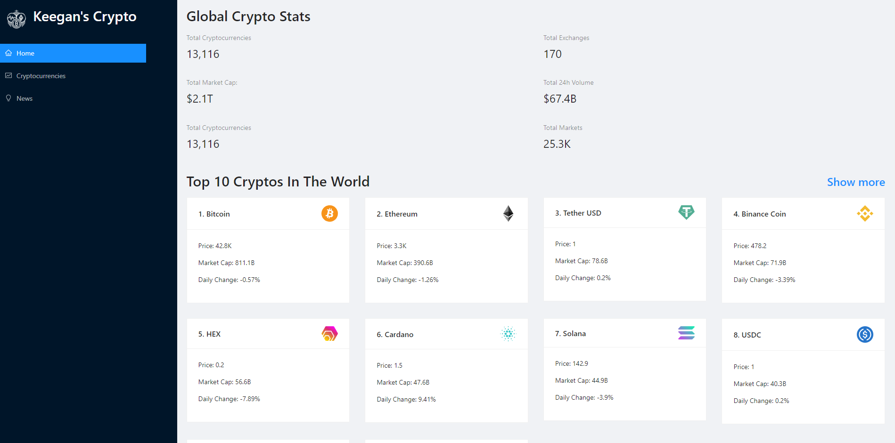

<div id="top"></div>
<!-- PROJECT LOGO -->
<br />
<div align="center">
  <h3 align="center">Crypto Web Application</h3>
  <p align="center">
    A React JS based web application used to monitor the prices and recent news of multiple different cryptocurrencies.
    <br />
    <a href="https://github.com/othneildrew/Best-README-Template"><strong>Explore the docs »</strong></a>
    <br />
    <br />   
</div>

<!-- TABLE OF CONTENTS -->
<details>
  <summary>Table of Contents</summary>
  <ol>
    <li>
      <a href="#about-the-project">About The Project</a>
      <ul>
        <li><a href="#built-with">Built With</a></li>
      </ul>
    </li>
    <li>
      <a href="#getting-started">Getting Started</a>
      <ul>
        <li><a href="#prerequisites">Prerequisites</a></li>
        <li><a href="#installation">Installation</a></li>
      </ul>
    </li>
    <li><a href="#usage">Usage</a></li>    
    <li><a href="#license">License</a></li>   
  </ol>
</details>

<!-- ABOUT THE PROJECT -->
## About The Project



This web application was designed to be a hub where the user can monitor and track the news and prices of cryptocurrencies as they develop. The application displays the following information regarding each crypto currency:

* Check information regarding a specific cryptocurrency such as current price, price history, market cap, market supply and total supply.
* Find and filter recent news articles regarding a cryptocurrency and provide a preview of the article.
* Display a chart to show the price history of the coin and ability to filter the price changes by duration.
<p align="right">(<a href="#top">back to top</a>)</p>

### Built With

This section should list any major frameworks/libraries used to bootstrap your project. Leave any add-ons/plugins for the acknowledgements section. Here are a few examples.

* [AntDesign](https://ant.design/)
* [React.js](https://reactjs.org/)
* [HTML5](https://html5.org/)
* [CSS3](https://www.w3.org/Style/CSS/Overview.en.html)
* [JavaScript](https://www.javascript.com/)


<p align="right">(<a href="#top">back to top</a>)</p>
<!-- GETTING STARTED -->

## Getting Started

### Prerequisites

To begin installation of the project, make sure you have the latest version of NodeJS installed in your code editor.
* npm
  ```sh
  npm install npm@latest -g
  ```

### Installation

To install the project, please follow the following steps:

1. Clone the repo
   ```sh
   git clone https://github.com/your_username_/Project-Name.git
   ```
2. Install NPM packages
   ```sh
   npm install
   ```


<p align="right">(<a href="#top">back to top</a>)</p>
<!-- USAGE EXAMPLES -->

## Usage

To run the application, please follow the following steps:
1. Run the project
   ```sh
    npm start   
    ```

<p align="right">(<a href="#top">back to top</a>)</p>

<!-- LICENSE -->

## License

Distributed under the MIT License. See `LICENSE.txt` for more information.

<p align="right">(<a href="#top">back to top</a>)</p>


